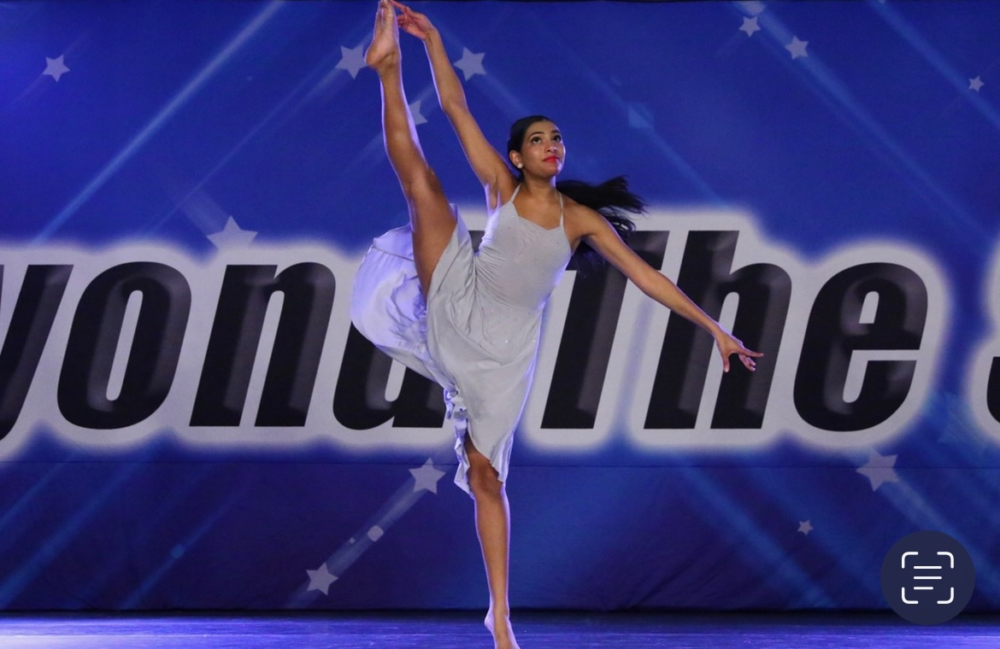

<!DOCTYPE html>
<html lang="en">
<head>
    <meta charset="UTF-8">
    <meta name="viewport" content="width=device-width, initial-scale=1.0">
    <link rel="stylesheet" href="styles.css">
</head>
<body>
    <header>
        <h1>Welcome to My GitHub Pages Site</h1>
    </header>
        <a href="newpage.html"> 
            <button> Learn More! </button> 
        </a>
    <main>
        
Welcome to my webpage! I am Trisha, a 3rd year undergraduate at Northeastern Univeristy. I am currently studying Behavioral Neuroscience with a minor in Data Science. I am currently on the pre-medical track, hoping to become a doctor specializing in pediatrics.  Outside of my academic pursuits, I am the most passionate about dance (I have been dancing since I was 10 years old!). I have done all sorts of competeitions and recitals over the years and every year it becomes more and more exciting. Dance has been such an important aspect of my entire life, which is why I chose to create a website about it. My favorite styles are contemporary and hip hop, but I love learning all styles - including ballet, tap, and jazz. I am a choreographer for No Limits Dance Crew on campus; I love being able creating pieces to share with people that all love to dance! Additionally, I am part of the South Asian Organization here at Northeastern and participate in their cultural dance showcase every year. Below you will find a few photos of my dance journey, from high school into college, I hope you can learn more about me and my love for dance! 

    </main>
    
    <footer>
    </footer>
</body>
</html>
